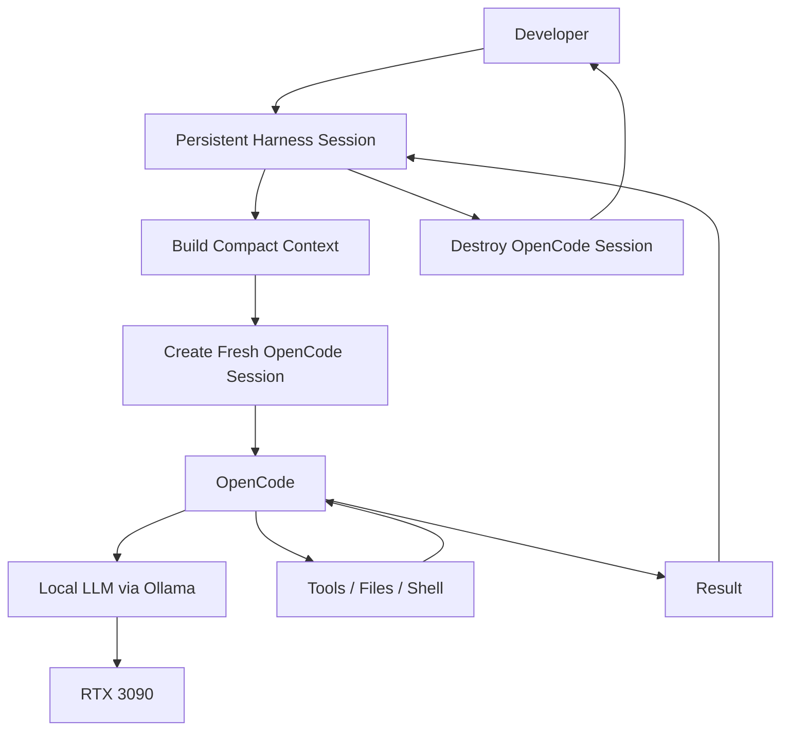
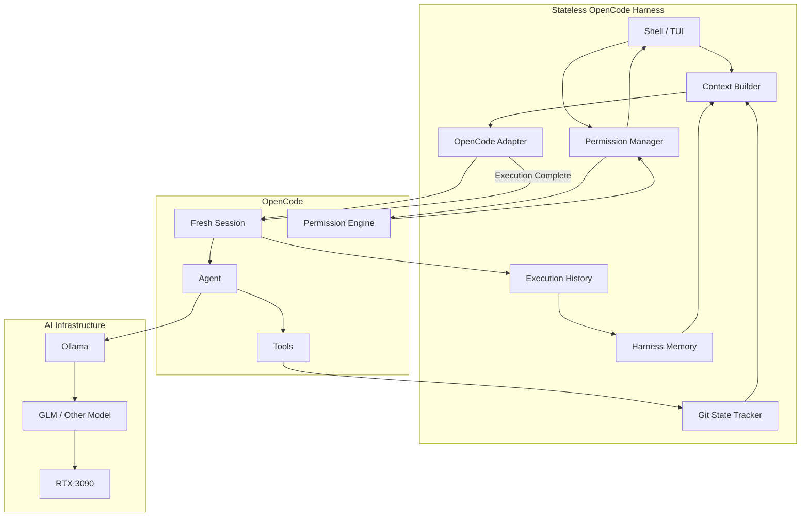
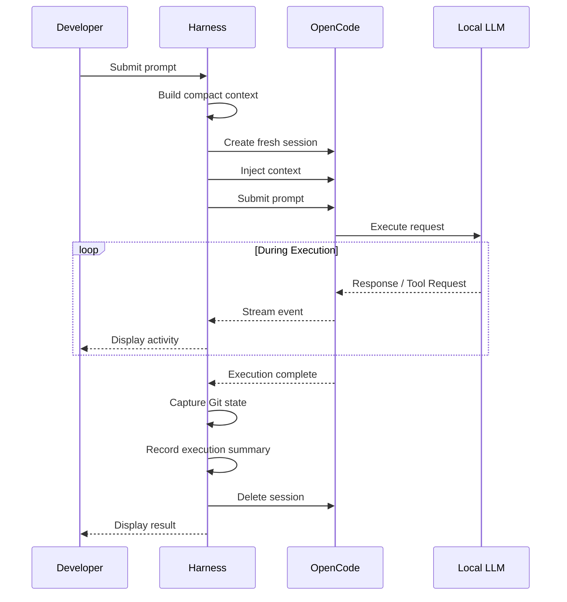
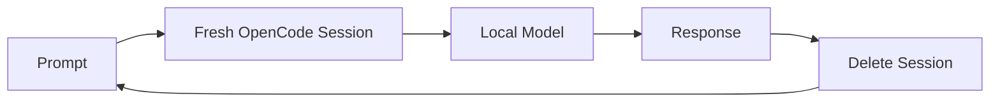
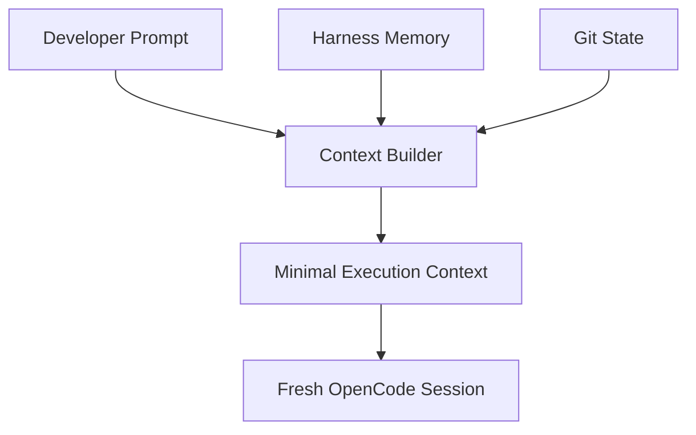

# OpenCode Stateless Harness — Product Requirements and Implementation Plan

## 1. Overview

The OpenCode Stateless Harness is a lightweight shell/TUI application that provides a persistent developer interaction layer over OpenCode while deliberately creating a **fresh OpenCode session for every submitted prompt**.

The harness will preserve the developer's working context, project state, decisions, execution history, and permission preferences while preventing OpenCode's LLM conversation context from continuously growing across interactions.

OpenCode remains responsible for:

- LLM interaction
- Agent execution
- File access
- File modification
- Shell command execution
- Tool execution
- Project configuration
- Agent configuration
- Permission enforcement

The harness is responsible for:

- The persistent human-facing session
- Creating fresh OpenCode sessions
- Supplying compact context to each session
- Streaming OpenCode activity to the developer
- Presenting permission requests
- Recording execution history
- Tracking repository changes
- Destroying OpenCode sessions after each interaction

The goal is **not to recreate OpenCode**.

The goal is to place a thin orchestration layer around OpenCode that is better suited to running large local models under constrained VRAM.

---

# 2. Why This Is Needed

## 2.1 Current Environment

The local AI environment includes:

- Linux-based AI server
- NVIDIA RTX 3090
- 24 GB VRAM
- Ollama
- Large local coding models such as GLM
- OpenCode as the coding-agent execution environment

Large coding models can consume most or all available VRAM.

Long-running OpenCode conversations also accumulate conversational context.

As the session grows, this creates several problems:

- Increasing context size
- Increasing prompt-processing time
- Increased memory pressure
- Reduced model performance
- Greater likelihood of exceeding practical local hardware limits
- Old conversation content being repeatedly processed even when no longer useful

The current practical workaround is to start a new OpenCode session for each significant prompt.

This solves the model-context problem but introduces another problem:

**The developer loses conversational continuity and must manually re-establish context.**

---

# 3. Core Architectural Idea

Separate the **human session** from the **LLM session**.

The harness maintains the persistent developer session.

OpenCode sessions are intentionally disposable.



Every developer prompt creates a new OpenCode session.

The harness provides only the context required for that particular request.

When the request completes, the OpenCode session is destroyed.

The next prompt starts with another clean OpenCode session.

---

# 4. Design Principles

## 4.1 OpenCode Remains the Execution Engine

The harness must not recreate functionality already provided by OpenCode.

OpenCode remains responsible for:

- LLM communication
- Agent execution
- File tools
- Shell tools
- Project instructions
- Agent definitions
- Model configuration
- Tool execution
- Permission enforcement

The harness orchestrates these capabilities through the OpenCode SDK/API.

---

## 4.2 Fresh LLM Context Per Prompt

Every submitted developer prompt must create a new OpenCode session.

The harness must not normally:

- Resume the previous OpenCode session
- Fork the previous OpenCode session
- Reuse previous OpenCode conversation history

Each execution begins with a clean model context.

---

## 4.3 Persistent Developer Context

Although OpenCode sessions are disposable, the developer's harness session persists.

The harness maintains:

- Project identity
- Current objective
- Current task
- Important decisions
- Previous execution summaries
- Relevant Git state
- Permission preferences
- Developer conversation

This information becomes the source from which compact context is generated.

---

## 4.4 Repository State Is Authoritative

The harness should not duplicate information that can reliably be discovered from the repository.

For example, instead of repeatedly describing every file modified during previous interactions, OpenCode can inspect:

```bash
git status --porcelain
git diff
git log --oneline
```

The repository itself should be treated as persistent project memory.

Harness context should primarily contain information that cannot easily be reconstructed from the repository.

Examples include:

- Developer intent
- Current objective
- Architectural decisions
- Constraints
- Explicit instructions
- Previous conclusions
- Known unresolved issues

---

## 4.5 Human Control Must Be Preserved

The harness must not bypass OpenCode's permission model merely for convenience.

Operations requiring approval must remain visible to the developer.

Examples may include:

- Access outside the project
- Potentially destructive commands
- Git commits
- Git pushes
- Sensitive filesystem operations
- Other commands configured as `ask`

---

# 5. High-Level Architecture



---

# 6. Functional Requirements

## FR-1 — Project Launch

The harness must be launchable from a project directory.

Example:

```bash
cd ~/Development/QuackTrack
quackharness
```

The harness must determine:

- Current working directory
- Git repository root
- Current branch
- Current HEAD commit
- Current working-tree status

---

## FR-2 — Persistent Harness Session

The harness must maintain a persistent session independently of OpenCode.

The harness session must survive multiple OpenCode executions.

The harness session should maintain:

- Developer prompts
- Execution summaries
- Important decisions
- Current objective
- Current task
- Permission preferences
- Relevant project context

---

## FR-3 — Fresh OpenCode Session Per Prompt

Each submitted prompt must:

1. Build compact execution context.
2. Create a new OpenCode session.
3. Configure the project working directory.
4. Supply required harness context.
5. Submit the developer's prompt.
6. Stream execution activity.
7. Handle permission requests.
8. Capture the final result.
9. Record execution metadata.
10. Destroy the OpenCode session.



---

## FR-4 — Context Builder

The harness must generate compact context for each OpenCode execution.

Context may include:

- Project objective
- Current task
- Important architectural decisions
- Constraints
- Previous execution summary
- Known unresolved issues
- Developer instructions

The context builder must avoid blindly resending the entire conversation.

The objective is:

> Send the minimum context required for the model to correctly perform the next task.

---

## FR-5 — Context Size Visibility

Before execution, the harness should provide visibility into the amount of context being supplied.

Example:

```text
Project: QuackTrack
Model: GLM
Branch: feature/import

Harness Context: ~2,430 tokens
Prompt: ~310 tokens

Starting fresh OpenCode session...
```

Exact token counts may be approximate when the model tokenizer is unavailable.

---

## FR-6 — Streaming Execution

The harness must stream OpenCode activity while execution is occurring.

The developer should be able to observe activity such as:

```text
Reading src/import.rs
Reading src/model.rs

Editing src/import.rs

Running:
cargo test

47 tests passed.
```

The harness should consume structured OpenCode events rather than scraping human-oriented terminal output whenever the SDK/API provides structured events.

---

## FR-7 — Permission Requests

OpenCode permission requests must be surfaced interactively.

Example:

```text
OpenCode requests permission:

Command:
git commit -m "Add duplicate flight detection"

Working directory:
~/Development/QuackTrack

[A] Allow once
[P] Allow for project
[D] Deny
```

The developer's response must be returned through OpenCode's permission API.

---

## FR-8 — Permission Policy

The harness should support persistent project-level permission preferences.

Example policy:

```text
Project Files

READ                     ALLOW
EDIT                     ALLOW

Outside Project

READ                     ASK
EDIT                     DENY

Shell

git status               ALLOW
git diff                 ALLOW
git log                  ALLOW
cargo test               ALLOW
npm test                 ALLOW
git commit               ASK
git push                 ASK
sudo                     DENY
```

OpenCode's native permission system should remain the enforcement mechanism wherever possible.

---

## FR-9 — Git State Tracking

Before every OpenCode execution, capture:

```bash
git rev-parse HEAD
git branch --show-current
git status --porcelain
git diff
```

After execution, capture the same state.

The harness must determine which files were:

- Added
- Modified
- Deleted

Example:

```text
Execution complete.

Modified:
  src/import.rs
  tests/import_test.rs

Added:
  src/duplicate.rs

Deleted:
  none
```

---

## FR-10 — Git Diff Visibility

After execution, the developer must be able to inspect the resulting Git diff.

Example:

```text
Execution complete.

3 files changed
+83
-11

[V] View diff
[C] Continue
```

The harness should not automatically commit changes in the initial implementation.

---

## FR-11 — Execution History

Every execution must receive a unique run identifier.

Example:

```text
Run #0042
```

Execution records should contain:

```text
Run ID
Timestamp
Project
Branch
Starting HEAD
Model
Agent
Prompt
Injected context
Permission decisions
Commands executed
Files changed
Final response
Execution status
Duration
```

---

## FR-12 — Cancellation

The developer must be able to cancel the current OpenCode execution without terminating the harness.

Example:

```text
Ctrl-C
```

should result in:

```text
Cancelling OpenCode execution...

Execution cancelled.

Harness session remains active.
```

---

## FR-13 — Model Selection

The architecture must support selecting different OpenCode-configured models.

Example:

```text
/model glm
/model qwen
```

The initial implementation may default to the project's configured model.

---

## FR-14 — Agent Selection

The architecture must support selecting OpenCode agents.

Example:

```text
/agent coder
/agent reviewer
/agent architect
```

Agent selection does not need to be exposed in the earliest milestone but must not be prevented by the architecture.

---

## FR-15 — Session Destruction

After every completed or cancelled execution, the harness must dispose of the OpenCode session.

OpenCode conversation state must not accidentally carry into the next execution.

---

# 7. Non-Functional Requirements

## NFR-1 — OpenCode Isolation

All OpenCode-specific functionality must be isolated behind an adapter.

Example:

```text
OpenCodeAdapter

createSession()
injectContext()
submitPrompt()
streamEvents()
respondToPermission()
cancelExecution()
getResult()
deleteSession()
```

This protects the harness from changes to the OpenCode SDK/API.

---

## NFR-2 — Recoverability

A harness crash must not damage the project repository.

Persistent harness state should be written atomically where practical.

---

## NFR-3 — Auditability

Every OpenCode execution should be reconstructable from the execution history.

---

## NFR-4 — Minimal Model Context

The system should minimize unnecessary context sent to the LLM.

Reducing model context is a primary reason the product exists.

---

## NFR-5 — Local-First

The harness must operate entirely with the existing local OpenCode/Ollama environment unless explicitly configured otherwise.

---

## NFR-6 — Low Overhead

The harness itself should consume minimal CPU and memory relative to the model infrastructure.

---

# 8. Suggested Project State

A project may contain:

```text
.quackharness/
├── state.json
├── context.md
├── decisions.md
├── permissions.json
└── history/
    ├── 000001.json
    ├── 000002.json
    └── 000003.json
```

This structure is illustrative and may change during implementation.

---

# 9. Explicit Non-Goals for Initial Development

The initial implementation will NOT attempt to provide:

- A replacement for OpenCode
- Its own LLM tool framework
- Its own file-editing engine
- Its own shell execution engine
- Multi-agent orchestration
- Autonomous task planning
- Vector databases
- RAG
- Automatic Git commits
- Automatic Git pushes
- Cloud synchronization
- Distributed inference
- Web UI
- IDE integration
- Workflow scripting language

These capabilities may be evaluated later.

The initial goal is much simpler:

> Prove that a persistent developer harness can reliably drive disposable OpenCode sessions.

---

# 10. Implementation Plan

# Milestone 0 — OpenCode SDK Feasibility Spike

## Goal

Prove that the installed OpenCode version provides the API capabilities required by the architecture.

No production application should be built until this milestone succeeds.

## Requirements

Create a minimal TypeScript program capable of:

1. Connecting to or hosting OpenCode.
2. Creating a session.
3. Assigning a project directory.
4. Using the existing local Ollama/GLM configuration.
5. Submitting a prompt.
6. Receiving streamed events.
7. Detecting a permission request.
8. Responding to the permission request.
9. Receiving the final response.
10. Cancelling an active request.
11. Deleting the OpenCode session.

## Required Test

Use a disposable Git repository.

Ask OpenCode to:

```text
Create a file named hello.txt containing "Hello from OpenCode".
```

The program must:

- Create a fresh OpenCode session.
- Receive the file-write activity.
- Handle any required permission.
- Verify the file was created.
- Capture the response.
- Delete the session.

Then create another OpenCode session and verify that it does **not** contain conversational history from the previous session.

## Exit Criteria

```text
Fresh session creation        PASS
Project directory             PASS
Local model invocation        PASS
Streaming events              PASS
Permission handling           PASS
File modification             PASS
Cancellation                  PASS
Session deletion              PASS
Session isolation             PASS
```

If any critical capability fails, stop and reassess the architecture.

---

# Milestone 1 — Minimal Harness

## Goal

Create the first usable command-line harness.

## Features

Implement:

```text
quackharness
```

with a basic prompt:

```text
QuackTrack >

```

Workflow:



Each submitted prompt must create and destroy an independent OpenCode session.

## Exit Criteria

The developer can submit multiple prompts without manually restarting OpenCode, and every prompt executes in a fresh OpenCode session.

---

# Milestone 2 — Streaming and Cancellation

## Goal

Make the harness usable for real coding operations.

## Features

Add:

- Streaming text output
- Tool activity display
- File activity display
- Shell command display
- Execution status
- Ctrl-C cancellation

Example:

```text
QuackTrack > Add validation for empty flight files.

Starting fresh OpenCode session...

Reading src/import.rs
Reading tests/import_test.rs

Editing src/import.rs

Running cargo test...

47 tests passed.

Execution complete.
```

## Exit Criteria

The developer can observe OpenCode activity in real time and safely cancel an execution without exiting the harness.

---

# Milestone 3 — Interactive Permission Handling

## Goal

Preserve OpenCode's interactive safety model.

## Features

Surface permission requests.

Support:

```text
Allow once
Allow for project
Deny
```

Persist project permission preferences where appropriate.

## Required Tests

Verify:

```text
Allowed command           executes
Ask command               prompts
Denied command            blocked
Outside-project read      follows policy
Outside-project edit      follows policy
```

## Exit Criteria

The harness can perform normal OpenCode development work without bypassing OpenCode's permission protections.

---

# Milestone 4 — Git Awareness

## Goal

Make every OpenCode execution traceable to repository changes.

## Features

Capture before/after:

```text
HEAD
branch
working-tree status
diff
```

Display execution summary:

```text
Run #18 complete.

Modified:
  src/import.rs
  tests/import_test.rs

Added:
  src/validation.rs

+74 / -12
```

Allow the developer to inspect the diff.

## Exit Criteria

For every execution, the developer can determine exactly what repository changes occurred.

---

# Milestone 5 — Persistent Harness Context

## Goal

Restore conversational continuity without restoring OpenCode conversational history.

## Features

Implement persistent harness state containing:

- Current objective
- Current task
- Decisions
- Constraints
- Previous execution summary
- Unresolved issues

Implement a context builder.



## Exit Criteria

The developer can refer naturally to previous work:

```text
QuackTrack > Now add tests for what we just implemented.
```

A fresh OpenCode session receives sufficient context to correctly understand what "what we just implemented" means.

---

# Milestone 6 — Execution History

## Goal

Provide a complete audit trail of agent activity.

## Features

Persist execution records.

Provide commands such as:

```text
/history
/history 42
```

Example:

```text
Run #42

Model: GLM
Agent: coder
Branch: feature/import
Starting HEAD: 8a31c2d

Prompt:
Add duplicate flight detection.

Changed:
  src/import.rs
  tests/import_test.rs

Commands:
  cargo test

Result:
  PASS

Duration:
  2m 14s
```

## Exit Criteria

Every OpenCode execution can be inspected after completion.

---

# Milestone 7 — Model and Agent Selection

## Goal

Allow the harness to use multiple OpenCode-configured models and agents.

## Features

Support commands such as:

```text
/model
/model glm
/model qwen

/agent
/agent coder
/agent reviewer
/agent architect
```

The selected model and agent apply to the next fresh OpenCode session.

## Exit Criteria

Different OpenCode agents and models can be selected without changing the harness architecture.

---

# Milestone 8 — Context Optimization

## Goal

Minimize LLM context while preserving execution quality.

## Features

Measure:

- Harness-context size
- User-prompt size
- Execution duration
- Model usage where available

Implement context pruning.

Prefer:

```text
Intent
Decisions
Constraints
Current state
Immediate previous result
```

over complete conversation transcripts.

## Exit Criteria

The harness consistently supplies substantially less context than a long-running OpenCode conversation while maintaining sufficient continuity for normal development work.

---

# Milestone 9 — Hardened Daily-Use Release

## Goal

Make the harness reliable enough for regular development.

## Features

Add:

- Crash recovery
- Session cleanup
- Stale OpenCode session detection
- Corrupt-state handling
- Structured logging
- Configuration validation
- Graceful Ollama/OpenCode failure handling
- Clear error reporting

## Exit Criteria

The harness can be used as the normal interface for local OpenCode development without requiring frequent manual recovery.

---

# 11. Future Possibilities

Once the core architecture is stable, additional capabilities can be evaluated.

Examples include:

```text
Developer
    │
    ▼
Persistent Harness
    │
    ├─────────────┬─────────────┐
    ▼             ▼             ▼
 Architect       Coder        Reviewer
 GLM             Qwen          GLM
    │             │             │
    └─────────────┴─────────────┘
                  │
                  ▼
             Same Repository
```

Potential future capabilities include:

- Architect → coder → reviewer workflows
- Different models for different roles
- Automatic review passes
- Task decomposition
- Context specialization by agent
- Parallel agents
- Remote compute nodes
- Mac Studio model execution
- Model routing
- Automated test/QA agents
- Integration with development specifications

These should remain outside the initial implementation until the fundamental stateless-session architecture is proven.

---

# 12. Definition of Success

The project succeeds when the developer can work naturally in a persistent shell session such as:

```text
QuackTrack > Implement duplicate-flight detection.

[OpenCode executes in fresh GLM session]

Completed.

Modified:
  src/import.rs
  tests/import_test.rs


QuackTrack > Good. Now handle collisions where the timestamps differ.

[Entirely NEW OpenCode/GLM session]

Reading previous harness context...
Reading repository state...

[OpenCode executes]


QuackTrack > Run the tests.

[Entirely NEW OpenCode/GLM session]

Running tests...
```

From the developer's perspective, this feels like one continuous coding-agent session.

From the LLM's perspective, every prompt is a **small, clean, independent session**.

That separation is the fundamental purpose of the system:

> **Persistent developer experience. Disposable LLM context.**
